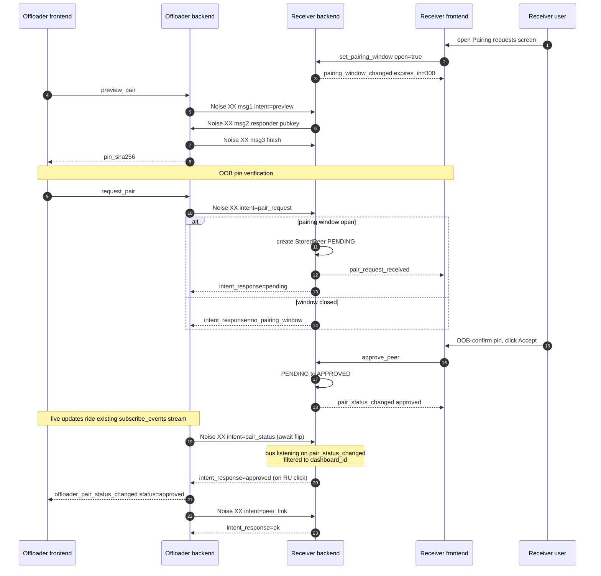

# Architecture

## Principles

1. **ESPHome is a CLI tool.** Firmware operations shell out to `esphome` via subprocess. Device metadata and serial ports use ESPHome Python imports. Board and component definitions come from our own `definitions/` directory.

2. **ESPHome is an optional dependency.** `pip install .[esphome]` pulls it in for standalone use. Plain `pip install .` works inside the ESPHome container.

3. **Frontend and backend are separate repos.** The frontend is a separate pip package. The backend try-imports it and serves the static files.

4. **WS-first API.** Everything goes through a single `/ws` WebSocket with command/response protocol. REST endpoints only for HA backward compat.

5. **Real-time events.** Clients subscribe once via `subscribe_events`, get instant push notifications. No polling needed.

6. **Persistent firmware jobs.** Compile/upload jobs are queued, run one at a time, survive page refreshes and server restarts.

7. **Device discovery.** mDNS browser for instant online/offline detection, ping sweep every 60s as fallback, optional MQTT discovery for devices that opt in via an `mqtt:` block. Source priority: `mdns > mqtt > ping`.

## Project Structure

High-level orientation; not exhaustive. The larger surfaces
(`controllers/devices/`, `controllers/firmware/`,
`controllers/remote_build/`) are Python packages with several
submodules each — see the source for the full layout.

```
esphome_device_builder/
├── device_builder.py          # Core singleton — owns controllers, event bus, web app
├── __main__.py                # CLI entry point
├── discover.py                # LAN discovery CLI
├── constants.py               # Version + defaults
│
├── models/                    # Data shapes only — no logic
│   ├── common.py              # EventType, ConfigEntry, PagedResponse
│   ├── devices.py             # Device, AdoptableDevice, DevicesResponse
│   ├── boards.py              # Board enums + models
│   ├── components.py          # Component enums + models
│   ├── firmware.py            # FirmwareJob, JobStatus, JobType
│   ├── labels.py              # Label catalog model
│   ├── onboarding.py          # First-run state model
│   ├── remote_build.py        # StoredPeer / StoredPairing + remote-build event payloads
│   ├── preferences.py         # UserPreferences, Theme, DashboardView
│   └── api.py                 # WebSocket protocol models
│
├── controllers/               # Business logic — all state lives here
│   ├── boards.py              # BoardCatalog: 490 boards across 6 platforms
│   ├── components.py          # ComponentCatalog: 896 components
│   ├── devices/               # DevicesController package: CRUD, file scanning, logs
│   ├── firmware/              # FirmwareController package: job queue, local + remote runners
│   ├── remote_build/          # RemoteBuildController package: pair flow, peer-link transport, job fanout
│   ├── automations.py         # AutomationsController: triggers + actions
│   ├── auth.py                # AuthController: session tokens
│   ├── config.py              # ConfigController + DashboardSettings + metadata
│   ├── editor.py              # EditorController: YAML editor + validation
│   ├── labels.py              # LabelsController: label CRUD
│   └── onboarding.py          # OnboardingController: first-run setup state
│
├── helpers/                   # Pure utilities (full set in source; key entries below)
│   ├── api.py                 # @api_command decorator
│   ├── atomic_io.py           # atomic_write (tempfile + os.replace)
│   ├── build_scheduler.py     # pick_build_path: LOCAL-vs-REMOTE dispatch decision
│   ├── dashboard_identity.py  # dashboard_id minting + metadata-sidecar I/O
│   ├── event_bus.py           # EventBus
│   ├── json.py                # JSON response, CORS
│   ├── peer_link_identity.py  # X25519 peer-link keypair load / rotate
│   ├── single_instance.py     # fcntl.flock guard for one process per <data_dir>
│   └── yaml.py                # YAML generation
│
├── api/                       # Transport layer
│   ├── ws.py                  # /ws WebSocket dispatch
│   └── legacy.py              # HA compat endpoints
│
└── definitions/               # Data files
    ├── boards/                # board YAML manifests
    ├── components.index.json  # slim component index (auto generated, loaded eagerly)
    ├── components/            # per-id component bodies (auto generated, hydrated lazily)
    └── schemas/               # JSON schemas
```

## Controllers

| Controller | Responsibility |
|-----------|---------------|
| Devices | Device CRUD, file scanning, YAML validation, live logs |
| Firmware | Job queue, compile, install, upload, download binaries |
| Boards | Board catalog with search, filtering, pin maps |
| Components | Component catalog with search, config entries |
| Automations | Context-aware triggers + actions |
| Auth | Session tokens, password gate, ingress-skip |
| Config | Version, serial ports, preferences, secrets |
| Editor | YAML editor save / validate / format |
| Labels | Label catalog CRUD |
| Onboarding | First-run setup state (welcome flow, default secrets, sample device) |
| RemoteBuild | mDNS browse + Noise XX peer-link pair / unpair / pair-status flows for the remote-build offload feature (issue #106) |

`ping` and `subscribe_events` are dispatched directly in `api/ws.py` and don't live on a controller.

## Event bus

In-process pub/sub, owned by `DeviceBuilder.bus` (an `EventBus` from `helpers/event_bus`). Controllers fire events on state transitions; WS commands subscribe via `subscribe_events` and stream them to connected clients. Event types are declared in `models/common.py` as `EventType(StrEnum)` members.

### Typing event payloads

`Event` and `EventBus.fire` are generic on the data shape so each event flows through with its TypedDict intact:

```python
@dataclass
class Event[DataT]:
    event_type: EventType
    data: DataT


class EventBus:
    def fire[DataT](self, event_type: EventType, data: DataT) -> None: ...
    def add_listener(
        self,
        event_type: EventType,
        listener: Callable[[Event[Any]], None],
    ) -> Callable[[], None]: ...
```

Each event-specific shape is declared as a `TypedDict` next to the controller that fires it. In `models/remote_build.py`:

```python
class RemoteBuildPairRequestReceivedData(TypedDict):
    dashboard_id: str
    pin_sha256: str
    label: str
    peer_ip: str
```

The fire site uses the TypedDict-call syntax so mypy validates the construction:

```python
self._db.bus.fire(
    EventType.REMOTE_BUILD_PAIR_REQUEST_RECEIVED,
    RemoteBuildPairRequestReceivedData(
        dashboard_id=dashboard_id,
        pin_sha256=pin_sha256,
        label=label,
        peer_ip=peer_ip,
    ),
)
```

The subscriber narrows by typing its callback's `event` parameter:

```python
def _on_pair_status(event: Event[RemoteBuildPairStatusChangedData]) -> None:
    status = event.data["status"]  # mypy: Literal['approved'] | Literal['removed']

bus.add_listener(EventType.REMOTE_BUILD_PAIR_STATUS_CHANGED, _on_pair_status)
```

`add_listener` is *not* generic on `DataT` — listeners share a bucket type-erased as `Callable[[Event[Any]], None]` and `Any`'s bidirectional compatibility lets a `Callable[[Event[XData]], None]` register cleanly. The type system enforces the *correct* pairing (subscriber typed for the matching event) but doesn't reject the *wrong* pairing (subscriber typed for a different event). Mismatches live in code review.

Mirrors HA core's `Event[_DataT]` / `EventType[_DataT]` pattern. Deliberate divergence: HA bounds `_DataT` to `Mapping[str, Any]` with that as the default so untyped events fall through; we drop the bound entirely. Untyped fire sites pass plain `dict[str, Any]` and mypy infers `DataT` from the call.

`TypedDict` rather than `@dataclass` because:

- The wire shape is a `dict`, not a class instance. `TypedDict` matches the runtime shape; `@dataclass` would need an `asdict()` step on every fire.
- Subscribers that ride the existing `subscribe_events` WS plumbing serialise the payload through `helpers.json.dumps` (orjson), which handles `dict` natively.
- It mirrors HA's convention so contributors moving between this codebase and HA find the same pattern.

`tests/test_event_payload_contracts.py` pins each TypedDict against its emitter at runtime — for every payload class, a factory invokes the production code path (TypedDict-call constructor or a helper that returns the dict literal as a TypedDict alias) and asserts the resulting dict's keys equal the TypedDict's `__annotations__`. A second test walks `models.*` and asserts every `*Data(TypedDict)` discoverable in the namespace is listed in the factory table — so a future PR adding a TypedDict can't silently skip the contract check.

New events should ship with a TypedDict from day one.

### Stateful lists ride `subscribe_events`, not `list_*` WS commands

Any per-session list whose contents mutate over the lifetime of a connected client (devices, importable devices, offloader pairings, receiver peers, …) reaches the frontend through one shape:

1. **RAM-canonical state on the controller.** A keyed dict (`controller._approved_peers: dict[str, StoredPeer]` keyed on `dashboard_id`, `_pairings: dict[str, StoredPairing]` keyed on `pin_sha256`, etc.) is the runtime source of truth. Mutations update the dict immediately and schedule a debounced disk write through a per-file `helpers.storage.Store` (`.receiver_peers.json`, `.offloader_pairings.json`). Reads — projections, post-mutation responses, dispatch lookups — read straight off the dict; no executor hop, no disk read, no read-vs-write race window. RAM seeds from the Store at `controller.start()`; disk is just persistence.

2. **First paint via `subscribe_events` `initial_state`.** A sync `*_snapshot()` method on the controller (`pairings_snapshot()`, `peers_snapshot()`) returns the projection. The seed point is the `_send_initial` inner async helper inside `DeviceBuilder._cmd_subscribe_events`, passed as the `send_initial=` callback to `helpers.event_bus.stream_events`; it stitches the snapshot into `initial["<key>"] = [s.to_dict() for s in controller.<key>_snapshot()]`. Snapshot reads must be sync — the subscribe handler runs in the WS dispatch hot path.

3. **Live updates via per-mutation TypedDict events.** Every state transition fires one event whose payload carries every field a subscriber needs to construct the row from the event alone. If the snapshot would carry a timestamp / pin / label, the event payload carries the same value (e.g. `RemoteBuildPairRequestReceivedData.paired_at`). The frontend mutates its local list directly from events; there is no follow-up "refetch" command.

4. **Listener-attach-then-snapshot ordering is load-bearing.** `stream_events` attaches the bus listener *before* awaiting the `send_initial` callback, so any event fired during the snapshot await is buffered behind the `initial_state` and delivered in order. Subscribers can rely on "initial state first, then live updates" without reordering logic.

The shape *not* to use on new code: `list_X` WS command read once on mount, re-fetched after every mutation. Three failure modes, all of which we've hit:

- **Read-vs-write races.** A snapshot read concurrent with a write returns whichever side won the lock, which may disagree with what the next event delivers a moment later; the frontend's local state ping-pongs until the user reloads. Receiver-side `remote_build/list_peers` had this exact shape before #514 — `load_remote_build_settings` on every read raced `_modify_settings` writes against the metadata sidecar.
- **Cross-tab desync.** A second tab mutating state never reaches the first tab unless the first tab re-polls; subscribers on the same dashboard see different worlds.
- **Round-trip overhead.** Every mutation pays a follow-up list-fetch the events were already going to deliver. On a cold tab the first paint is gated on the round-trip.

Carve-outs that are *not* state-surfaces and stay RPC: `devices/list_archived` (cold archive directory listing, dedicated screen, read-once). `labels/list` is the middle-ground holdover — snapshot-fetch-then-events rather than full subscribe-driven; new code should land through `initial_state` rather than copy that shape.

## Firmware Job Queue

Jobs are persistent, event-driven, and decoupled from WebSocket connections:

```
firmware/install {configuration} → QUEUED → RUNNING → output... → COMPLETED/FAILED
                                     │                                    │
                                     └──── persisted to disk ─────────────┘
```

- Three concurrent lanes — a compile lane (CPU, one job at a time), an
  upload lane (network, up to `MAX_CONCURRENT_UPLOADS` = 3 flashes at
  once), and a single-slot thread upload lane. The lanes run in parallel
  so a slow network flash doesn't block the next device's compile
  (#3702), and OTAs don't serialize behind each other (esphome
  discussion #3781). The concurrency exists for deep-sleep wake
  delivery: when several deep-sleep devices wake at once, each queued
  update must land inside its device's wake window — with one serial
  upload slot, the flashes behind a slow OTA missed their window, the
  devices went back to sleep, and their updates failed. The upload cap
  bounds the combined memory of concurrent esphome subprocess trees
  (peak concurrency is the cap plus one thread flash); each lane spawns
  `Lane.max_concurrency` workers off one FIFO queue, and running
  subprocesses live in the job-keyed `FirmwareState.processes` registry
  so cancel signals exactly one job. **OpenThread flashes serialize**:
  Thread devices share one mesh / border router, and concurrent OTAs
  over the mesh starve each other, so `lane_for` routes a network flash
  whose device loads `openthread` (per `DevicesController.is_thread_device`,
  reading the last compile's `loaded_integrations`) to the thread lane.
  That slot is deliberately global, not per-mesh: two independent Thread
  networks serialize against each other too, because mesh membership
  isn't data the dashboard has.
  A device never compiled yet routes to the normal upload lane — the
  lookup is wired into `FirmwareState.is_thread_configuration` when the
  controller constructs its state, so restored flashes route the same way.
  `install` splits into a COMPILE job + a dependent local UPLOAD job
  (`depends_on`): the upload is held until the compile succeeds, then
  runs on its upload lane; a cancelled/failed compile cascades to cancel
  the held upload.
- **Rename is the same chain shape** (#1812): `devices/rename` rewrites
  `esphome.name` dashboard-side (`helpers.yaml.rewrite_rename_content`),
  writes `<new>.yaml` up-front, and queues a COMPILE of it (remote-eligible
  like an install's) plus a dependent RENAME *tail*
  (`FirmwareJob.is_rename_tail`) that `esphome upload`s the **old** device
  address (resolved at enqueue: StorageJSON → scanner → mDNS default,
  stamped into `port`) on the upload lane, then drops the old YAML +
  StorageJSON. Any non-COMPLETED tail terminal reverts the chain — deletes
  the new YAML — via `rename_flow.on_job_terminal`, hooked at all three
  finalisation sites (`finalize_terminal`, the QUEUED-cancel branch,
  restore-with-lost-prerequisite). `FirmwareState.rename_fs_lock` orders a
  retry's supersede → write against the superseded chain's revert unlink;
  cancelling the tail cascades *up* to its compile. A persisted RENAME
  with no `depends_on` (pre-decomposition) still runs the fused
  `esphome rename` CLI on the compile lane.
- Plus a **remote build-server pool** — one more consumer (`run_dispatch_loop`)
  gathered alongside the lane workers. Compiles eligible for a paired server
  hold here (off the single compile lane) and run concurrently, one per
  connected server. See "Remote build-server pool" below.
- Output buffered in `FirmwareJob.output` — survives disconnect
- `firmware/follow_job` sends history then streams live
- Error detection scans output for failure patterns (not just exit code)
- Jobs persist across server restarts

**Output is lazy-loaded from per-job sidecars, not held in RAM.** Job
*metadata* lives in the `.device-builder.json` blob; a terminal job's
*output* lives in its own sidecar log at
`<CORE.data_dir>/dashboard-jobs/<job_id>.log` (so `/data/dashboard-jobs/`
on the HA addon). While a job is live its output stays in
`FirmwareJob.output` for live followers; on the terminal transition
`persist_jobs` writes the buffer to the sidecar and clears it from RAM,
so an idle dashboard holds metadata only (~15 MB saved with a full
history). `load_jobs` restores metadata without reading any log into
RAM — a legacy blob with inline output is migrated to sidecars on
first load — and `follow_job` replays a finished job's log from disk
(falling back to the still-populated RAM buffer during the brief window
before the post-completion flush lands). `persist_jobs` is serialized
through a per-controller lock with the job snapshot taken under it, and
reaps sidecars for pruned/cleared jobs plus orphaned temp files.

## Component Catalog

`definitions/components.index.json` (slim) plus per-id bodies at
`definitions/components/<id>.json` are generated by `script/sync_components.py`
from ESPHome's pre-built schema bundle (https://schema.esphome.io). The
slim index loads eagerly at dashboard startup; bodies hydrate on demand
via `ComponentCatalog.get_body` through a bounded LRU so an idle
dashboard doesn't carry the per-field config_entries trees in RAM.
Schema + narrow live `esphome` introspection cover most fields; `multi_conf`,
`platform_defaults`, `supported_platforms`, type refinement (boolean / float
recovery), `unit_of_measurement` autocomplete options, and `cv.typed_schema`
`default_type` recovery (read from the validator's closure so a discriminator
select is optional with the right default) come from the live package.
Platform-domain entries (`sensor.*`, `output.*`, ...) are additionally stamped
`multi_conf=True` regardless of upstream `MULTI_CONF`, which is absent on
platform stems; a platform domain is an unbounded YAML list, so every variant is
repeatable. The platform-domain set itself is derived, not hand-curated: the
schema bundle's `core.platforms` (upstream's `IS_PLATFORM_COMPONENT` markers)
refreshes `_PLATFORM_DOMAINS` at sync time, the shipped catalog's dotted-id
prefixes seed it at import, and the YAML serializer reads platform-ness off the
dotted id directly. A new upstream domain missing a `ComponentCategory` member
fails the sync loudly instead of degrading to MISC.
Component-level descriptions and titles fall back to the docs MDX
(`esphome.io` shallow clone) when the schema's index is sparse.

The same script runs nightly via
[`.github/workflows/sync-component-catalog.yml`](../.github/workflows/sync-component-catalog.yml)
— it pins the schema version to the dashboard's installed `esphome` to avoid
drift, runs `script/check_catalog.py` as a regression guard, and opens a
PR with a diff summary when the rebuild produces a change.

## CI / Release pipeline

- **`test.yml`** runs lint + the catalog smoke test on every PR, plus pytest
  across the supported Python matrix. Also callable as a preflight from
  `release.yml`.
- **`release.yml`** is the publish entrypoint — `workflow_dispatch` from
  the Actions tab or `workflow_call` from `auto-release.yml`. Inputs:
  - `version` — `X.Y.Z` for stable, `X.Y.ZbN` for beta.
  - `channel` — `release` or `prerelease`. Format must match (e.g.
    `release` rejects a `b`-suffix tag).

  The workflow stamps `pyproject.toml`, builds wheel + sdist, tags +
  creates the GitHub release with notes drafted from merged-PR labels
  (config in [.github/release-drafter.yml](../.github/release-drafter.yml)),
  attaches both artifacts, and publishes to PyPI. The GitHub release is
  an output of the workflow — don't publish one by hand.

  Tagging + release creation use the `ESPHOME_GITHUB_APP_*` org credentials
  so the workflow keeps working under branch protection. PyPI publish uses
  `PYPI_TOKEN` and is currently `continue-on-error: true` — drop that
  flag once a publish has succeeded.
- **`auto-release.yml`** runs nightly. If ≥ 2 commits have landed on
  `main` since the last release, computes the next prerelease version
  (`X.Y.ZbN` → `X.Y.Zb(N+1)`, or `X.Y.Z` → `X.Y.(Z+1)b1`) and calls
  `release.yml` with `channel=prerelease`. Stable releases are always
  manual.
- **`pr-labels.yaml`** enforces exactly-one-of the changelog labels.
- **`dependabot.yml`** keeps actions and pip dependencies fresh; `esphome`
  itself is pinned manually so the catalog smoke test stays a meaningful
  guard.

All workflow files are commented — start there for the source of truth.

## Cold-start import discipline

The long-lived dashboard process never imports `esphome.components.*`.
Importing `esphome.components.esp32` transitively pulls espidf → `requests` →
`esphome.config`, roughly 9s of cold start before the first log line on an HA
Green. Two mechanisms keep it out:

- **Snapshot the static data.** Everything the dashboard needs that's keyed on
  the esphome version (esp32 variants + libretiny families for download
  routing, esp32 no-wifi variants + rp2040 no-wifi boards for wifi inference,
  and the static `get_download_types` lists for esp32/esp8266/rp2040) is
  generated into `definitions/platform_capabilities.index.json` by
  `script/sync_components.py` and read at runtime via
  `load_platform_capabilities_index`. The committed index is a subset of the
  installed esphome (the CI matrix runs newer esphome); the nightly sync keeps
  it current.
- **Subprocess the one dynamic case.** `get_download_types` for libretiny and
  nrf52 reads the build directory, so it can't be precomputed. The dashboard
  spawns `device-builder-helper` (`helper_cli.py`), which imports
  `esphome.components.<X>` in a throwaway child and returns JSON; the reply is
  validated through `coerce_download_entries` at the boundary.

`script/check_import_time.py` (import budget) and
`tests/test_cold_import_floor.py` (`sys.modules` probe after import + `start()`)
guard the invariant in CI. New code that needs `esphome.components.*` data
precomputes it into the index or runs in the helper, never an in-process import.

## Authentication

Auth is opaque server-issued session tokens, gated by the WebSocket handshake. See [API.md](API.md#authentication) for the wire protocol and [THREAT_MODEL.md](THREAT_MODEL.md) for what the auth gate is defending (short version: authenticated callers are host-equivalent, because `external_components:` provides arbitrary Python at compile time).

When `--ha-addon` is set, the server binds **two** TCP sites on a shared `DeviceBuilder` singleton:

- **Public site** (`--host:--port`, default `0.0.0.0:6052`) — the standard dashboard. The auth middleware enforces password on REST endpoints, and the WS handler enforces the in-band `auth` handshake. This is what users hit at `http://homeassistant.local:6052`.
- **Trusted ingress site** (`--ingress-host:--ingress-port`) — binds **loopback + the supervisor gateway only** (`127.0.0.1` + `172.30.32.1`), never `0.0.0.0`. The add-on runs host-network (for mDNS), so `0.0.0.0` would put this no-auth site on the LAN; the two-host default keeps it reachable by HA core's ESPHome integration (loopback) and the supervisor's ingress proxy (gateway) only. A second layer, `ingress_peer_guard` (`helpers/auth.py`), 403s any TCP peer other than loopback or the supervisor (`172.30.32.2`), so another hassio-bridge add-on reaching the gateway can't use it either — mirroring the legacy add-on's nginx `allow 127.0.0.1; allow 172.30.32.2; deny all`. Skips the auth gate because the supervisor has already authenticated the request upstream. An explicit `--ingress-host` overrides. The HA add-on `config.yaml` advertises `ingress_port` to the supervisor so the ingress proxy knows where to forward.

This is the Music Assistant pattern: physically separating the listeners is the security boundary, rather than trusting an `X-Ingress-Path` header. It also means HA app users can keep ingress access (no password) while operators can still secure direct access from outside HA with a username/password.

The legacy `DISABLE_HA_AUTHENTICATION=true` env var (the add-on's "Disable external authentication" / `leave_front_door_open` option) opens the front door: when it is set *and* the operator has mapped port 6052 (the add-on passes `--ha-addon-allow-public`), the public port is bound on `0.0.0.0` with no authentication at all, while the trusted ingress site stays bound so the HA sidebar keeps working. Both opt-ins are required, mirroring the legacy add-on, where nginx only listened on 6052 when the port was mapped and `leave_front_door_open` only cleared auth on that direct block; setting just one is a no-op (ingress-only) with an explanatory log line. The supervisor `/auth` credential-forwarding path is not carried forward (issue #85), so a mapped port without the front-door opt-in stays ingress-only rather than gating with HA credentials. `run` logs a loud banner whenever it binds the unauthenticated public port.

### Reverse-proxy / cross-origin deployments

When the dashboard is exposed behind a reverse proxy (nginx, Caddy, Traefik, nginx-proxy-manager, …) under a hostname that doesn't match the upstream bind address, the WS handshake's strict `Origin === Host` check rejects the connection. Operators set `--trusted-domains` (or `$ESPHOME_TRUSTED_DOMAINS`, the legacy ESPHome dashboard env var name) to a comma-separated allowlist of hostnames they want the dashboard to accept:

```bash
# CLI
esphome-device-builder /config --username dash --password ... \
  --trusted-domains dashboard.example.com,proxy.example.com

# Env var (matches the legacy ESPHome dashboard's name)
ESPHOME_TRUSTED_DOMAINS=dashboard.example.com esphome-device-builder /config ...
```

The allowlist drives two checks in the WS handshake (both opt-in; empty = strict legacy behaviour):

- **Origin allowlist** — accepts cross-origin connections whose `Origin` header's hostname is in the list. Required for any reverse-proxy deployment where the proxy hostname differs from the upstream Host.
- **Host allowlist** — rejects any connection whose `Host` header isn't in the list. Defense in depth against DNS rebinding (an attacker domain that resolves to the victim's LAN IP would carry an unfamiliar Host).

Both gates apply only to requests that carry an `Origin` header. Browsers always set `Origin` for the WebSocket opening handshake, so DNS-rebinding attempts land inside the gate; non-browser clients (CLI tools, the HA integration, direct `websockets` clients) omit `Origin` and skip both gates. The in-band `auth` handshake does the work for those clients, and gating on `Origin` means an operator hardening against rebinding doesn't accidentally lock out their HA integration.

The cross-origin gate applies to **every public-site deployment**, password-gated or not — a passwordless dashboard is still reachable only by the operator's own browser sessions, never by whatever malicious page they happen to visit. The same allowlist drives REST CORS in `helpers/json.py:cors_middleware`: `Access-Control-Allow-Origin` is reflected only when `Origin` matches `Host` or is in `--trusted-domains` (else omitted, so the browser blocks the calling JS from reading the response). The HA Ingress site (`trusted_site=True`) skips both gates because the supervisor handles auth upstream; the listener binds only loopback + the supervisor gateway (`127.0.0.1` + `172.30.32.1`), never all interfaces, and `ingress_peer_guard` 403s any peer that isn't loopback or the supervisor — so it's not reachable from the LAN or another add-on even though the add-on runs host-network.

Match is case-insensitive and port-tolerant: `dashboard.example.com` accepts `Dashboard.Example.com:8443`. IPv6 may be entered with or without brackets (`::1` and `[::1]` both work). Use `*` as the only entry to opt out of the Host restriction while still permitting cross-origin handshakes (handy when the Host varies per request).

### Binding to a network interface name

`--host`, `--ingress-host`, and `--remote-build-host` each accept either an IP literal (the usual `0.0.0.0` / `127.0.0.1` / a specific LAN IP) or a **local network interface name** (`eth0`, `wlan0`, `lo`, …). When the value matches an interface present on the host, the bind expands to every IPv4 / IPv6 address currently assigned to that interface.

### Binding to a UNIX socket

`--socket` allows the public site to be served on a UNIX socket instead of a TCP socket. Authentication and `Origin`/`Host` gates continue to be enforced as normal. The socket file is (re)created with default permissions based on the process `umask` and removed on shutdown.

When listening on a UNIX Socket, the configured `--host` and `--port` are ignored, except that they are still used for the dashboard's mDNS advertisement. When used in conjunction with a reverse proxy, they can be set to the proxy's bound IP and port.

## Discovery (mDNS)

Two mDNS surfaces ride the same `AsyncEsphomeZeroconf` instance the device state monitor already owns. Sharing one Zeroconf singleton matters: opening a second responder fights for the same multicast socket and silently drops half the packets.

**Devices** (`_esphomelib._tcp.local.`) — passive browse. ESPHome devices broadcast on this service type; `DeviceStateMonitor`'s browser callback turns `Added` / `Updated` / `Removed` events into ONLINE / OFFLINE state transitions and TXT-driven config-hash / version / api-encryption updates. See "Two mDNS paths with different OFFLINE semantics" in [CLAUDE.md](../CLAUDE.md) for the asymmetric trust rules between the browser callback and the one-off active-resolve path.

**HTTP identity fallback** (`_http._tcp.local.`) — passive browse on the same shared browser. A device without `api:` never publishes `_esphomelib._tcp` (that service is behind `USE_API`); its broadcast is the `_http._tcp` service — the bare fallback, or `web_server`'s own. On new firmware (esphome/esphome#17520) that service carries the identity TXT trio `version` / `mac` / `config_hash`; older firmware carries `version` only on the fallback and nothing on a web_server service. `MdnsSource._on_http_service_state_change` applies whichever identity keys are present for configured non-API devices through the shared `_apply_identity_txt`, so the card leaves "Waiting for mDNS discovery…" and the update dot can use the hash comparison. It deliberately never applies api-encryption (a device with no API has no encryption state to confirm) and drives **no** ONLINE/OFFLINE state (no claim off the HTTP service) — reachability stays owned by the active-resolve / MQTT / ping paths. It does own one non-reachability signal: the non-API side of `runtime_state.deployed_identity_live`, the session-only freshness bit the frontend gates the deployed identity on (a non-API device can hold `active_source == "mdns"` off a bare A-record resolve, but that vouches reachability only, so the api-device mdns gate deliberately doesn't apply). Every identity-bearing apply stamps it true, as does the post-flash optimistic sync (first-party evidence for mDNS-dark deployments); the API-info sweep's level-sync stage below owns the non-API clear side. The same flag also carries the api-device Native-API evidence — see the fallback below. See "Two mDNS paths with different OFFLINE semantics" in [CLAUDE.md](../CLAUDE.md).

**Native API info fallback** (`ApiInfoSource`, `controllers/_device_state_monitor/api_info.py`). When mDNS multicast can't reach the dashboard (the common Docker-bridge case) a device is ONLINE via ping but its `mac_address` / `deployed_version` stay blank — those come only from the `_esphomelib._tcp` TXT records. A fourth source repairs them in three stages per sweep. First a free, level-triggered reconcile: re-apply the zeroconf-*cached* TXT payload (both the `_esphomelib._tcp` record and a non-API device's `_http._tcp` identity TXT) for any online device still missing a field (no claim, no IP — a cache hit can be stale). The browser's apply path is edge-triggered, so an announce whose resolve timed out leaves the record blank while its records still land in the cache, and zeroconf never re-fires the handler for same-content TTL refreshes (#1910). Second, another free stage level-syncs every non-API device's `deployed_identity_live` flag against the unexpired cached `_http._tcp` identity TXT: a live TXT under a lowered flag re-runs `reconcile_from_cache` (which also refreshes *populated* fields the missing-field gate never revisits), and a raised flag over a dark cache triggers the targeted `verify_http_identity` re-resolve (capped per sweep like the API probes), clearing only on a confirmed miss — and only for devices with some cached mDNS trace, since an mDNS-dark deployment's wire miss proves nothing and its post-flash stamp must survive. Third, for devices the cache can't fill, a Native API connect. That stage is deliberately narrow: one probe at a time, only for an online device that loads the `api` integration, still misses a field (regardless of which source owns it — ownership proves a resolve, not an applied TXT), is off its failure cooldown, and has a routable IP. `aioesphomeapi` never loads into the long-lived process — a `find_spec` guard plus a short-lived `python -m esphome_device_builder.helpers.api_device_info` worker keep it in the child (the encryption key is passed over stdin, never argv). It only ever writes TXT-derived fields through the `apply_*` methods, so it **stays out of the `mdns > mqtt > ping` precedence ledger** and never drives ONLINE/OFFLINE. A payload that carried mac or version also stamps `deployed_identity_live` (a confirming re-probe counts — the connection itself is the evidence); the stamp site is `apply_worker_info`, shared with the API reviver's verified revival dial. The ownership rule lives once, in the monitor: a `live=True` stamp is refused while mDNS owns an api device, and the flag clears when mDNS takes ownership, so the announce lifecycle (verify-before-demote `Removed`) governs blanking from there. An mDNS-dark api device therefore keeps its Native-API-confirmed identity trusted the same way an mDNS-dark non-API device keeps its post-flash stamp.

**Persisted-IP revival** (`ApiReviverSource`, `controllers/_device_state_monitor/api_reviver.py`). The one Native API path that *does* drive state. When a device's mDNS responder goes quiet, the `.local` won't resolve in a container, and its RAM `ip_addresses` are gone (cleared by a confirmed `Removed`, or empty after a restart), the sweep claims OFFLINE with no target forever — even though the last-known IPv4 survives in `Device.ip` (RAM mirrors the metadata sidecar; a `Removed` clears only the resolved set, #2029). A bare ICMP reply at that wall-clock-old DHCP address is inadmissible as ONLINE evidence (whatever now holds the lease answers — the #1776 latch class), so revival is identity-gated: candidates are `api:` devices with **no other reachability signal** (not ONLINE, persisted `ip`, empty RAM addresses, no zeroconf-cached addresses, a cached DNS failure proving the sweep already tried); the persisted IP is ICMP'd first as a purely *negative* filter (silence = no dial); only when something answers does one short-lived `device_info` worker dial run, and ONLINE is claimed — under the `ping` source, so the ordinary sweep owns liveness and demotion from then on — only when the reported name matches (MAC corroborating when both sides know it). A name mismatch instead proves the IP stale and clears it through `on_persisted_ip_invalidated`, the one path that drops a last-known `Device.ip` (RAM and metadata store). Because an API connect occupies one of the ESP's scarce connection slots, dials are serial, capped at 3 per sweep, back off exponentially on failure, and a verified `name → ip` cache lets flaps revive on the ICMP filter alone (the same trust RAM-learned addresses get) but only within a freshness TTL — past it one dial re-verifies, so a lease reassigned during a long silent gap can't ride a stale verification back to ONLINE. ICMP-unavailable deployments are deliberately not repaired: the negative filter can't run and a verify-only ONLINE could never demote.

**Dashboards** (`_esphomebuilder._tcp.local.`) — bidirectional. The dashboard advertises its own service instance on startup (skipped in HA-addon mode by default; the addon container's docker IP isn't LAN-routable). The service-instance name and SRV target are stable per-install identifiers (`esphome-builder-<dashboard_id[:8]>`) derived only from the persisted `dashboard_id`, never the OS hostname; this keeps the SRV target from flipping when the OS hostname changes across reboots (macOS flips `mac` ↔ `macbook-pro`), which otherwise forced a needless endpoint rebind on every restart. TXT carries `server_version` + `esphome_version` + `friendly_name` (the human machine label, carried here because the instance name is now an opaque identifier) always; `pin_sha256` + `remote_build_port` are added when the remote-build receiver site is bound. Browse runs in `RemoteBuildController` and populates `self._peers`; a sync `hosts_snapshot()` seeds the `subscribe_events` initial-state push under `hosts` and the browser's `_on_service_state_change` / `_resolve_and_apply` callbacks fire `remote_build_host_added` / `remote_build_host_removed` events as dashboards come and go. Cross-subnet peers (the LAN's mDNS doesn't reach them) bypass discovery entirely — the pair dialog accepts a typed `hostname` / `port` and `request_pair` either succeeds or fails.

## Remote build

The dashboard can play two roles, often both at once:

* **Receiver** — lends its CPU to other dashboards. Accepts pair requests, compiles, returns artifacts. Surfaced in the UI as **"Build server"** (Settings → Build server, the card that shows this dashboard's identity fingerprint + paired senders).
* **Offloader** — delegates compiles to a paired receiver. The dashboard the user clicks Install on. Surfaced in the UI as **"Send builds"** (Settings → Send builds, the section that lists known + paired receivers).

A single dashboard can be both roles simultaneously — the HA add-on ships offloader-on / receiver-off by default (a typically-shared host shouldn't accept inbound build jobs without opt-in), while ESPHome Desktop and standalone installs default to both roles on. The two surfaces don't conflict: a dashboard can have receivers paired to it AND be paired to other receivers itself.

Transport is Noise XX over plain-TCP WebSocket — the original HTTPS-plus-bearer-token shape was pivoted out during the receiver-side rewrite when the Noise XX peer-link replaced both transport security and auth on a single channel.

### Pairing auth flow (Noise XX)

Pairing is a two-side flow, but in the typical case both sides are operated by the same user with two dashboards open in different tabs (HA add-on + ESPHome Desktop, two HA instances they own, etc.). The trust model already concentrates authority on each side: anyone with shell-level access to either dashboard's `<config_dir>` can read or rotate the X25519 peer-link keypair, mint pair_requests, or accept them, so distributing pair-time authority across multiple humans only makes sense when they're already shell co-administrators of the same deployment. The flow is: open the receiver's Pairing requests screen in one tab, click Pair on the offloader in another, OOB-confirm the pin matches both UIs, click Accept back on the receiver. The two-operator case (a shared deployment) is supported and uses the same protocol; it just means switching tabs becomes "ask my colleague to look at theirs."

Out-of-band pin verification defeats a LAN MITM at first contact (the only window where pinning hasn't established trust yet); the **pairing window** narrows when new requests are even accepted (only while the Pairing requests screen on the receiving dashboard is mounted) so an idle receiver doesn't accumulate inbox noise from arbitrary LAN scanners. Already-approved peers connect anytime for real builds; the window only gates new pair_requests.

The cryptographic primitives are `Noise_XX_25519_ChaChaPoly_SHA256` (mutual identity exchange + forward secrecy) over a dedicated peer-link TCP listener (default port 6055, separate from the dashboard UI port; configurable via `--remote-build-port`; when the port is taken, e.g. by a sibling add-on flavor on the same host, the bind falls forward to the next free port and the mDNS TXT advertises the one actually bound). Each dashboard holds a long-lived X25519 keypair as its peer-link identity, persisted at `<config_dir>/.device-builder-peer-link-key.bin` (0o600); `pin_sha256` is the lowercase-hex SHA-256 of the static pubkey.

The numbered phases (WS commands in the `remote_build/` namespace and events with the `remote_build_` prefix are abbreviated in the diagram further down):

1. **Discovery** — both dashboards advertise on mDNS (`_esphomebuilder._tcp.local`); TXT carries `remote_build_port` + `pin_sha256` (lowercase-hex SHA-256 of the X25519 peer-link pubkey).
2. **Receiver opens pairing window** — the user opens Settings → Build server → Pairing requests on the receiving dashboard; the frontend calls `remote_build/set_pairing_window` with `open=true`; the backend flips an in-process deadline and fires `remote_build_pairing_window_changed`. The window closes automatically on screen-unmount or user-idle timeout.
3. **Preview pair (intent=preview)** — three Noise XX handshake messages. The offloader captures the receiver's static pubkey from the handshake transcript and surfaces `pin_sha256` to the user; no application data crosses the wire.
4. **OOB pin verification** — human-mediated. The user compares the pin shown on the offloader UI against the receiver UI's Build server card.
5. **Pair request (intent=pair_request)** — fresh Noise XX with payload `{label, dashboard_id}`. If the pairing window is open and no APPROVED row exists yet, the receiver adds a PENDING entry to its in-memory `_pending_peers` dict (no disk write), fires `remote_build_pair_request_received`, and returns `intent_response=pending`. If the window is closed, returns `intent_response=no_pairing_window`. If an APPROVED row already exists with a matching pin, returns `intent_response=approved` immediately (re-pair against existing trust, bypasses window gate).
6. **Receiver-side approve** — user OOB-confirms the offloader's pin, clicks Accept on the receiving dashboard; `remote_build/approve_peer` pops the dict entry, persists it to `settings.peers` as APPROVED, fires `remote_build_pair_status_changed`.
7. **Offloader observes approval (event-pushed, no polling)** — when `request_pair` returns PENDING, the offloader controller writes the row into the unified `_pairings` dict (PENDING status) and spawns one `_pair_status_listener` asyncio task. The listener opens a Noise WS to the receiver with `intent=pair_status`; the receiver-side `lookup_peer_for_status` registers a bus listener for `remote_build_pair_status_changed` filtered to the matching `dashboard_id` and parks until admin clicks Accept / Reject (bus event fires → re-snapshot → return `approved` / `rejected`) or window-close fires the same event with status="removed" for each cleared dict entry. The listener flips the row's status to APPROVED in place + schedules a debounced save through the per-file `Store`, then fires `offloader_pair_status_changed` on the offloader's local bus — any client subscribed to the global `subscribe_events` stream picks the event up; no separate subscription channel.
8. **Subsequent real-build sessions** — `intent=peer_link`. **Not gated by the pairing window**; paired peers connect anytime. The receiver looks up the offloader's static-pubkey-hash against its `StoredPeer` table; an APPROVED match returns `intent_response=ok` and the session stays open for application messages.



**Why two Noise handshakes for one pairing.** The preview handshake (step 3) captures the receiver's static pubkey for OOB display *before* the offloader has decided to trust this receiver; the WS closes immediately, no application data crosses the wire. The pair-request handshake (step 5) is a fresh handshake that re-binds the OOB-confirmed pin (defends against TOCTOU between preview and confirm: if the pubkey-hash on the second handshake doesn't match `pin_sha256` from preview, the offloader aborts). Re-handshakes are cheap because Noise's setup cost is negligible at this cadence (pair flows are rare, not a hot path).

**Why long-poll instead of polling.** The pair-status path holds a Noise WS open with `intent=pair_status` for each PENDING row. The receiver-side `lookup_peer_for_status` parks on its own bus's `pair_status_changed` event filtered to the matching `dashboard_id` and pushes the response when admin clicks Accept / Reject — sub-second flip latency without a poll cadence. Transport errors retry after a 2s backoff; terminal flips (APPROVED / REJECTED) exit the listener.

**PENDING is in-memory only, bounded by the pairing window.** Disk only carries APPROVED rows. Receiver-side: `RemoteBuildController._pending_peers: dict[str, StoredPeer]` holds PENDING peers for the *active pairing window's* lifetime; the dict is cleared on every window-close transition (auto-close timeout, explicit `set_pairing_window(open=False)`, controller `stop()`). The clear path fires `pair_status_changed("removed")` for each cleared entry so any in-flight pair_status long-poll wakes, re-snapshots, and reports REJECTED to its offloader; the offloader's listener then drops its own pending state. Offloader-side: a single `_pairings: dict[tuple[str, int], StoredPairing]` carries both PENDING and APPROVED rows — the per-file `Store` at `<config_dir>/.offloader_pairings.json` filters PENDING out at serialise time so the on-disk shape stays APPROVED-only, and the dict is the canonical source of truth at runtime. Three load-bearing properties fall out of this:

1. **A malicious LAN scanner can't fill the receiver's settings file with junk pair-requests** even within an open window — the dict is RAM-bounded by window lifetime, never persisted, and capped by admin's screen-mounted attention span (typically minutes).
2. **The pair_status long-poll's window-gate is implicit** — closed-window means the dict is empty, so any pair_status query returns REJECTED naturally via the `_lookup_peer_response` dict-then-list lookup. No separate `is_pairing_window_open()` check needed at the snapshot path.
3. **Cold-start has no PENDING state** — a controller restart means the dict starts empty; any in-flight pair attempts have to be re-initiated by the offloader. There is no respawn-on-subscribe path because the offloader doesn't have a separate subscription channel; live updates ride the existing global `subscribe_events` stream as `offloader_pair_status_changed` events fired by the per-row listener task.

**The `pair_request` window-gate.** Lives inside `record_pair_request`, not at the WS dispatcher. New offloaders (no row anywhere) and refresh of an existing PENDING dict entry are gated; `pair_request` against an *already-APPROVED* row + matching pin bypasses the window check (re-pair against existing trust requires no admin authorization, so the network-blip-retry case stops surfacing NO_PAIRING_WINDOW just because admin's screen happens to be closed). APPROVED + drifted pin returns REJECTED regardless of window state — rotation-or-impersonation signal that admin must explicitly handle via `remove_peer` then re-pair.

**Window-state disclosure.** The `no_pairing_window` response from `record_pair_request` only reaches an offloader whose `dashboard_id` doesn't match an APPROVED row (the APPROVED check short-circuits ahead of the window gate). Random callers / unknown peers get the same NO_PAIRING_WINDOW response when window is closed, so the window flag is observable to anyone who can reach the listener — but it's not informationally useful: the listener's mDNS TXT broadcasts `pin_sha256` + `remote_build_port` only while bound, which is itself the strongest signal of the receiver's overall pair-acceptance state.

**Identity rotation.** `rotate_identity` mints a fresh X25519 peer-link keypair and writes it to `.device-builder-peer-link-key.bin`. The follow-up listener-rebuild step is conditional on the listener's current bind state:

* **Listener bound** — `DeviceBuilder.reload_remote_build_identity` tears down the current runner (the in-flight Noise dispatch closure holds the old private bytes; without a rebuild the next session would still handshake against the old key), clears `pin_sha256` + `remote_build_port` from the mDNS TXT (TXT contract: those fields appear iff the listener is currently bound), and re-runs the bind path to load the new identity. Fail-soft: a rebuild failure leaves the dashboard running without a receiver listener.
* **Listener not bound** — no-op beyond the disk write. The new key sits at the canonical path and the next successful bind picks it up; no mDNS push happens because there's no port to advertise.

The `dashboard_id` stays stable across rotation either way; `pin_sha256` (the SHA-256 of the new pubkey) changes, so every paired peer sees a `pin_mismatch` event on the next handshake and has to re-pair. That's the intended UX for "operator suspects compromise" — one rotation revokes every existing trust on this side without touching anything else.

### Headless build server (`--remote-build-only`)

A machine whose only job is lending CPU can run the backend as a service with no dashboard at all:

```sh
esphome-device-builder --remote-build-only /var/lib/esphome-builder
```

The positional argument is the standard config dir, but in this mode it holds the server's *identity* (X25519 keypair + `dashboard_id`), the pairing, and build state rather than device YAMLs — and it is **required** (no `./configs` fallback): a cwd-relative default would mint a fresh identity — new fingerprint, new mDNS name, re-pair needed — whenever the service started from a different directory. Keep it persistent; wiping it resets the fingerprint and requires re-pairing.

The flag flips three things:

* **No HTTP site.** `DeviceBuilder.run` skips `web.run_app` entirely and drives the controller lifecycle through `_remote_build_only.run_remote_build_only` — the peer-link Noise listener (and its mDNS advertise) is the process's only network surface besides discovery. There is no WS dashboard, no ingress, no REST.
* **Force-enabled listener.** `maybe_start` ignores a persisted `RemoteBuildSettings.enabled=false` — with no UI to flip the toggle back on, honouring it would brick the mode. Not combinable with `--ha-addon` (the parser rejects the pair; the add-on opts in via its Settings toggle).
* **First-pair bootstrap.** With no UI there's nobody to click Accept, so on first run (zero APPROVED peers) the process opens a 15-minute pairing window (longer than the UI window's 5 minutes, since the key removes the trust-on-first-use race), arms a **one-shot auto-approve** (`ReceiverState.auto_approve_first_pair`) with a freshly generated **one-time pairing key** (`ReceiverState.bootstrap_pairing_key`, `helpers/pairing_key.py`), and prints a banner to the console — the pin as the 7-emoji Matrix-SAS sequence (`helpers/pin_emoji.py`) plus emoji names, formatted hex, and the pairing key. The operator pairs from the main builder's UI, verifies the fingerprint shown there matches the banner, and types the key into the pair dialog; the first `pair_request` inside the window presenting that key is approved without the inbox dance (the row is flushed to `.receiver_peers.json` before the wire response — this write is the mode's single trust anchor, so it is not debounced) and the window closes behind it. **Exactly one pairing**: the auto-approve disarms on use and only ever fires with zero APPROVED rows; with no UI to open another window, later pair requests get `no_pairing_window`. If nothing pairs before the window lapses the process exits 1 (a service restart opens a fresh window — the Bluetooth-style trade an operator accepts by re-running it). Subsequent runs with an APPROVED peer skip the bootstrap and just serve.

The trust model: the window is explicit (operator started the process), time-boxed, single-use, and gated on the console-printed pairing key — racing the window is not enough. The key is 16 chars from a 30-char unambiguous alphabet (~2^78), compared constant-time (`hmac.compare_digest`) after normalising case / separators / whitespace; a wrong or missing key is refused as a closed window (leaking nothing) *without* disarming, so a typo means retry, brute force is not viable inside the window, and there is deliberately no failure lockout (a lockout would let an attacker spam garbage keys to deny the legitimate pairing). On the builder-to-receiver peer-link wire the key rides only in the encrypted Noise msg3, and the offloader verifies the receiver's static key against the previewed pin *between msg2 and msg3* (`PeerLinkPinMismatchError`) so the secret is never written to an unverified responder; the operator-to-builder leg is the ordinary dashboard WS (plaintext `ws://` by default, same channel as the login password), so a sniffer there is the pre-existing dashboard trust boundary rather than new exposure. The OOB fingerprint compare on the main builder remains the verification in the other direction (a fake receiver harvesting builds). `--allow-pairing-source <IP>` (comma-separated, IPv4/IPv6) composes as optional defense in depth — `pair_flow._pairing_source_allowed` refuses non-listed sources the same indistinguishable way; `--allow-any-pairing-source` restates the default and is kept for compatibility (the parser rejects both-at-once and passing either without `--remote-build-only`). Residual risk is written up in `docs/THREAT_MODEL.md`. The emoji rendering is the Matrix SAS spec's 64-emoji vocabulary (6-bit chunks of the leading 42 bits) — `helpers/pin_emoji.py` is an exact port of the frontend's `src/util/pin-emoji.ts`, and each side pins the algorithm with a shared known-vector test so the CLI banner and the pair dialog always show the same sequence for a given pin.

### Listener internals

**Second TCP listener.** When `_remote_build.enabled` is `true`, `DeviceBuilder` binds an aiohttp site on `--remote-build-port` (default 6055) serving `/remote-build/peer-link`. A taken port falls forward to the next free one (bounded scan of `REMOTE_BUILD_PORT_SCAN_ATTEMPTS` candidates, each held on every bind host from probe to listen so concurrent starters can't race it) — the stable/beta/dev add-on flavors share one host-network host, and only one can hold each port. Default is `True` on standalone / Desktop installs; the HA addon overrides the default to `False` at the bind site (a fresh addon install with no persisted `_remote_build` block doesn't bind — the addon container's docker IP isn't LAN-routable without an explicit `ports:` override). When the toggle is off the listener doesn't bind at all (a sidecar `enabled=false` skip beats default-deny 404s — nothing to probe). This sits alongside the public + ingress sites from the Authentication section: HA-addon mode with remote-build enabled binds three listeners on three different ports, each with its own role.

**Middleware.** A single `_strip_server_header_middleware` overrides aiohttp's `Server: Python/x.y aiohttp/z.w` banner to empty string on the peer-link site. (Setting to empty wins; `del response.headers["Server"]` doesn't catch the connection-level injection.)

**Identity** (`helpers/dashboard_identity` + `helpers/peer_link_identity`). Two long-lived identities are minted on first dashboard start:

* **`dashboard_id`**: a stable random identifier under `_remote_build.dashboard_id` in the metadata sidecar. Load-bearing as the offloader-presented identity on every Noise pair_request / peer_link / pair_status frame; the receiver pins against `pin_sha256` (below) and uses `dashboard_id` as the bookkeeping key.
* **Peer-link X25519 keypair**: a 32-byte raw X25519 secret persisted at `<config_dir>/.device-builder-peer-link-key.bin` (0o600). This is the keypair the Noise XX handshake exchanges; `pin_sha256` advertised in mDNS TXT is the lowercase-hex SHA-256 of the static pubkey. Owned by `DeviceBuilder.peer_link_identity_store` (one `PeerLinkIdentityStore` per dashboard process) so the disk read happens at most once per process and rotation refreshes the cache atomically under the store's `asyncio.Lock` — concurrent loaders never see a pre-rotation identity once the on-disk write has landed. The Noise dispatch closure still captures the identity for the listener's lifetime; rotation rebuilds the listener.

The TXT contract — `pin_sha256` + `remote_build_port` appear together iff the listener is currently bound — holds across rotation. When the listener isn't bound, rotation only writes new keys to disk; mDNS isn't updated because there's no listener for peers to connect to.

### Long-lived peer-link sessions

Once an offloader and receiver are paired (APPROVED on both sides), the offloader maintains *one long-lived Noise WS per receiver* over which all subsequent application messages flow — `queue_status` push, `submit_job` + bundle upload, `cancel_job`, `download_artifacts` round-trip (flash-artifact tarball back to the offloader for local install). The session is established on `intent=peer_link` (step 8 of the pairing flow above), kept alive by an encrypted heartbeat, and auto-reconnected on transport blips. Receiver-side surface is `_run_peer_link_session`; offloader-side is `PeerLinkClient`.

**Bring-up.** After the post-handshake `intent_response: ok` lands, both sides enter their dispatch path:

**Receiver-side.** `_run_peer_link_session` constructs a `PeerLinkSession`, calls `register_peer_link_session` (which inserts into `_peer_link_sessions: dict[dashboard_id, PeerLinkSession]` with concurrent-connect dedupe via `TerminateReason.SUPERSEDED`), starts a heartbeat task, and parks on `_receive_loop`. Registration refreshes the APPROVED `StoredPeer`'s display identity (`friendly_name` / `ha_addon`) from the session's msg3 (non-empty-only for the name, so an older offloader can't clobber a captured value) and fires `EventType.RECEIVER_PEER_LINK_SESSION_OPENED` with `{dashboard_id, friendly_name, ha_addon}`; the `queue_status` push subscriber uses this hook to send the initial snapshot to a freshly-connected offloader without a lookup-then-push race window.

*Inbound dispatch:*

* `submit_job` / `submit_job_chunk` → `SubmitJobReceiver` drives `BundleAssembler`; on completion writes the assembled tarball + queues a `FirmwareJob` carrying `remote_peer` + `remote_job_id` correlation.
* `cancel_job` → `RemoteBuildController.handle_cancel_job` reverse-lookups the offloader-supplied id via `JobFanout.resolve_firmware_job_id` and calls `FirmwareController.cancel`, same primitive as a local operator-driven cancel.
* `download_artifacts` → `ArtifactsDownloadSender` reads `idedata.json` + flash images via the shared `helpers/build_artifacts.py` discovery helper, packs them into a gzipped tarball off the event loop, and streams the bytes back as `artifacts_start` → `artifacts_chunk` → `artifacts_end`. `firmware_offset` rides on the start frame so the offloader doesn't duplicate platform-detection logic.

*Outbound:*

* `queue_status` broadcast on every firmware-queue transition.
* `job_state_changed` / `job_output` per-job fan-out: `JobFanout` subscribes to firmware `JOB_*` bus events, filters to jobs whose `remote_peer` matches an active peer-link session, and routes through the submitting session's `send_app_frame`.

**Offloader-side.** `PeerLinkClient` builds a `PeerLinkChannel` over `(noise, ws)`, fires `EventType.OFFLOADER_PEER_LINK_OPENED` with `{receiver_hostname, receiver_port, pin_sha256, esphome_version, auto_provision_supported, reset_build_env_supported, friendly_name, ha_addon}`, and parks on its own receive loop with a parallel heartbeat task. The frontend Settings UI's "connected" indicator subscribes to this event; `pin_sha256` lets subscribers correlate to a specific paired row without an additional lookup, and the other fields carry the receiver's `esphome.const.__version__`, capabilities (auto-provisioning + remote reset), and display identity (its mDNS `friendly_name` plus the HA add-on flag) from the post-handshake `intent_response` so paired-row UI can render them without a follow-up RPC. The controller's OPENED listener refreshes all five onto the `StoredPairing` (the name non-empty-only), so a receiver upgrade or rename surfaces on the next session-open.

*Inbound dispatch:*

* `queue_status` → fires `OFFLOADER_QUEUE_STATUS_CHANGED`.
* `submit_job_ack` → resolves the matching ack future on `_submit_job_acks`.
* `job_state_changed` → fires `OFFLOADER_JOB_STATE_CHANGED`, maintained as RAM cache in `_offloader_remote_jobs` keyed on offloader-local `job_id`; terminal rows drop on transition.
* `job_output` → fires `OFFLOADER_JOB_OUTPUT`, no cache; high-rate live stream only.
* `artifacts_start` / `artifacts_chunk` / `artifacts_end` → drives a per-job `BundleAssembler` capped at `FIRMWARE_MAX_TOTAL_BYTES` = 16 MiB. The start frame's `firmware_offset` rides through to the resolved `DownloadArtifactsResult` so the WS layer's unpacker can stitch it back into the response without re-deriving.

*Outbound:*

* `submit_job` + chunk stream + ack wait — driven by the remote runner's dispatch (`PeerLinkClient.submit_job`). Header carries `total_bundle_bytes` / `num_chunks` / `bundle_sha256`; chunks stream via `chunk_bundle()` generator without materialising the slice list.
* `cancel_job` — fire-and-forget, driven by the remote runner's cancel translation (`PeerLinkClient.cancel_job`). The receiver's resulting `job_state_changed{cancelled}` is the confirmation.
* `download_artifacts` — driven by `remote_build/download_artifacts`. Parks on a per-job future the receive-loop dispatchers fill; returns a `DownloadArtifactsResult(tarball, firmware_offset)` the WS layer unpacks into `{idedata, images, total_bytes}`.

Cache + alert state seeds into `subscribe_events.initial_state` so late-subscribing tabs paint without waiting on the next event.

The two OPENED events fire on slightly different schedules — the receiver writes `intent_response: ok` *before* entering `_run_peer_link_session`, so the offloader's OPENED can fire an event-loop tick ahead of the receiver's. Tests that need both sides ready use the e2e harness's `wait_until_session_opened` (waits on both events).

**Heartbeat.** Symmetric, encrypted, both directions: each side sends `{"type": "ping", "nonce": N}` every `HEARTBEAT_INTERVAL_SECONDS` and expects `{"type": "pong", "nonce": N}` within `HEARTBEAT_DEAD_AFTER_SECONDS`. Three consecutive misses close the session — receiver via `terminate{reason: heartbeat_timeout}`, offloader via WS close + the offloader's `_run_session_loops` shared-state surface that propagates `heartbeat_timeout` into the local close reason instead of falling through to the default `peer_hung_up`.

**Close paths and bus events.** Wire close reason is one of `TerminateReason`: `superseded` / `server_shutting_down` / `heartbeat_timeout` / `malformed_frame`. The offloader-side rich classification additionally distinguishes `transport_error` / `client_stopped` / `peer_hung_up` / `auth_rejected` / `pin_mismatch`.

* **Receiver-side** — `unregister_peer_link_session` fires `EventType.RECEIVER_PEER_LINK_SESSION_CLOSED({dashboard_id})` only when it actually drops the slot. The SUPERSEDED-evicted-finally-block path is a no-op there so a single logical close doesn't double-fire.
* **Offloader-side** — `OFFLOADER_PEER_LINK_CLOSED({receiver_hostname, receiver_port, pin_sha256, reason, error_detail})` carries the rich reason category for the UI to branch on plus a one-line `error_detail` (e.g. `"ConnectionRefusedError: [Errno 61] Connection refused"`) the UI surfaces under the paired-row's "Last connection error" line. Empty `error_detail` means the category itself was the explanation (clean `client_stopped` / `superseded` / receiver-driven `terminate` frames).

**Connection state on `PairingSummary`.** The wire view of an offloader-side pairing carries three fields that together describe the live link to the receiver:

* `connected` — true while the post-handshake session is parked on the receive loop.
* `connecting` — true while the per-pairing client task is alive but no session is currently open. Covers both the very first connect attempt and every subsequent reconnect-backoff cycle in `PeerLinkClient.run`. Both `connected` and `connecting` go false on the orphan paths (`pin_mismatch` / `superseded`) where the run loop won't retry — the operator's recovery there is re-pair / unpair, not "wait for reconnect."
* `last_connect_error` — one-line description of the most recent connection failure (transport / Noise exception text, `"auth rejected"`, `"pin mismatch"`). Clears when a session reaches the post-handshake open state so a stale message can't outlive a successful reconnect.

The frontend computes the live state from the snapshot plus the existing `OFFLOADER_PEER_LINK_OPENED` / `_CLOSED` events: OPENED transitions to `connected=true, connecting=false, last_connect_error=""`; CLOSED transitions to `connecting=true (still trying), last_connect_error=event.error_detail` for non-orphan reasons, or to both-false-with-message for orphan reasons. No new event for connection-state surfacing — the existing pair carries everything the UI needs.

**Auto-reconnect.** The offloader's run loop wraps each session in a `connect → handshake → receive` iteration; on any close other than `superseded`, it sleeps an exponentially-backed-off delay (`_RECONNECT_INITIAL_BACKOFF_SECONDS=1s` → `_RECONNECT_MAX_BACKOFF_SECONDS=30s`) and reconnects. Backoff resets on every iteration that *opened* a session (tracked via `_session_was_opened`), so a flaky path doesn't permanently degrade to the cap. `superseded` is the one terminal close — a newer offloader instance with the same `dashboard_id` has taken our slot, so reconnecting would just collide and storm the receiver's accept queue; the client orphans (`_orphaned=True`) and exits `run`.

**Endpoint rebind.** A paired receiver that changes hostname / port stays paired — same `pin_sha256`, different routing coordinates. Two entry points share one commit primitive:

* **Automatic mDNS rebind** (#539). The discovery loop notices an mDNS record whose advertised `pin_sha256` matches an APPROVED pairing's pin but whose `(hostname, port)` differs from `StoredPairing.receiver_hostname` / `.receiver_port`. The auto-rebind path runs a one-shot `peer_link_preview_pair` probe against the new endpoint to verify the pin still matches (defends against an mDNS poisoner advertising a stranger's hostname under a victim's pin), then commits the new coords in place.
* **User-driven `remote_build/edit_pairing_endpoint`** (#548). Fallback for cross-subnet / no-mDNS receivers where the auto-rebind path can never fire. Pencil-icon in the frontend opens a focused two-input dialog; the WS command takes `{pin_sha256, hostname, port}` and runs the same probe + commit primitives the auto path uses.

The two share `_probe_pairing_endpoint` (returns a typed `_RebindProbeResult` — OK / UNREACHABLE / PIN_MISMATCH / PAIRING_REPLACED / STATUS_CHANGED) and `_commit_endpoint_rebind` (mutates `StoredPairing.receiver_hostname` / `.receiver_port` in place on the controller's event loop — no async-lock acquisition, the single-event-loop discipline is the concurrency guard — schedules the debounced save, cancels + respawns the `PeerLinkClient` against the new coords, and clears the per-pin mDNS rebind-probe throttle (`_rebind_probe_until`) so a future mDNS Updated for the same pin probes immediately instead of waiting the cooldown out). Pin-mismatch refuses the edit and leaves the stored pairing untouched — the user's existing trust is keyed on the original pin; substituting a fresh pubkey under that trust is what the re-auth wizard exists to gate.

**Cancellation.** `RemoteBuildController.stop()` cancels every entry in `_peer_link_clients`. Each task's `CancelledError` handler sends a structured `terminate{reason: client_stopped}` over the live channel before unwinding so the receiver's session loop exits cleanly without waiting for its heartbeat to time out. The handshake path's exception clause catches `TypeError` alongside `(TimeoutError, aiohttp.ClientError, OSError, ValueError)` because `aiohttp.ClientWebSocketResponse.receive_bytes()` raises `TypeError` on a non-binary frame or abrupt close — without it the long-lived task would die instead of reconnecting.

**Test infrastructure.** Two layers. Single-side tests under `tests/test_remote_build_peer_link.py` (receiver) / `test_remote_build_peer_link_client.py` (offloader) drive each side against the other-side stub via `aiohttp.test_utils.TestServer` — pinning per-side wire shape and the close-reason classification matrix. The e2e harness under `tests/e2e/` (`paired_instances` fixture) stands up two real `RemoteBuildController` instances on real `EventBus`es with the receiver's listener bound to a real ephemeral TCP port, drives the full pair flow (`set_pairing_window` → `preview_pair` → `request_pair` → `approve_peer`) and lands on a live peer-link session ready for application-message tests to build on. Catches mismatches between the two sides (event payload contracts, dashboard_id collisions, terminate flow with both sides observing) that single-side tests can't reach.

### Transparent install flow

Install is **one user-visible flow**: the user clicks Install on a device card, the offloader picks a build path (local or one of the paired remote runners), the receiver builds and the offloader installs — bytes always flow through the user's dashboard. The default Install entry collapses local-and-remote into a single subscriber on the existing `JOB_*` event stream; there is no separate explicit-dispatch surface (the testing-era "Send builds → Build remotely" flow was removed).

**Load-bearing policy: the receiver only ever compiles; the offloader always installs.** Remote dispatch sends the peer-link `submit_job{target: "compile"}` wire frame exclusively (`PeerLinkClient.submit_job`, driven by the remote runner). The receiver may not be able to reach the device (cross-subnet, NAT, segregated Wi-Fi); the offloader by definition can (it renders the device card with the IP its own scanner cached). One extra `download_artifacts` round-trip per remote install is the cost — paid for determinism and "the bytes always come from your dashboard." The policy is universal: a receiver rejects any wire `target: "upload"` with `upload_unsupported` (older offloaders sent it expecting a receiver-side flash; that path hung headless servers on the esphome CLI's interactive device chooser, #2107, and the manual Send-builds submit surface that produced it has been removed).

**Build-path decision — `pick_build_path` (#553).** `helpers/build_scheduler.py` exports `pick_build_path(BuildSchedulerInputs) -> BuildPathDecision`, a pure function that takes the offloader's `_pairings` / `_open_peer_links` / `_peer_queue_status` snapshot (passed as a frozen `BuildSchedulerInputs` wrapper with `Mapping` / `frozenset` typing so mutation is locked at the type layer) plus the user's `remote_builds_enabled` toggle. Walks the pairings sorted by `paired_at` ascending (pin-sort tiebreaker so the choice is deterministic across `Mapping` impls) in two passes: **first** picks the oldest APPROVED + connected + idle candidate so new installs fan out across multiple idle remotes; if no idle candidate qualifies, a **second pass** picks the oldest APPROVED + connected pairing regardless of queue state, so the dispatch lands behind the receiver's own firmware queue rather than silently falling back to LOCAL (which used to split the fleet across two compile contexts and re-flash from a different build than the first Install). LOCAL only when **no** APPROVED + connected pairing exists. `BuildPathDecision.pin_sha256: str | None` rather than an empty-string sentinel — the type system forces every consumer to narrow before reading. The `is PeerStatus.APPROVED` gate is fail-closed-by-construction: future enum members are silent-fallback-LOCAL until the scheduler is explicitly taught about them.

**Local vs remote is a first-class property of `FirmwareJob` (#556, #558).** One `FirmwareJob` per build; the runner branches on `source` to pick its pipeline. No wrapper layer, no duplicate state, no event-translation bookkeeping. `FirmwareJob` carries three dispatch-origin fields:

* `source: JobSource` — `LOCAL` or `REMOTE`. The discriminator the runner branches on.
* `source_pin_sha256: str` — matches `StoredPairing.pin_sha256`. The machine-readable handle the runner needs to route `download_artifacts` / `cancel_job` against the right peer-link client after a restart-recovery (the RAM-only `_open_peer_links` cache doesn't survive).
* `source_label: str` — display string the install dialog reads for the "Building on {receiver_label}" sub-line.

`FirmwareJob.reset()` preserves all three plus the receiver-side `remote_peer` / `remote_job_id` — all describe the job's dispatch origin, not per-run state.

**Source-routed runner (#560).** The firmware queue's `_execute_job` branches on `job.source`:

* **LOCAL** — runs the existing `esphome run` subprocess pipeline unchanged.
* **REMOTE** — hops into `controllers/firmware/remote_runner.py`, which:
  1. Looks up the open `PeerLinkClient` against the pin in `job.source_pin_sha256`.
  2. Builds the bundle via `helpers/config_bundle.build_yaml_bundle` (`helpers/config_bundle` is the single bundling path), streaming the `esphome bundle` output into the job log with phase-marker and heartbeat notices (`controllers/firmware/bundle_phase.py`) so slow validation is visible before `submit_job`; a Stop click cancels the bundle subprocess immediately.
  3. Dispatches a peer-link `submit_job` with `target="compile"`.
  4. Subscribes to `OFFLOADER_JOB_STATE_CHANGED` + `OFFLOADER_JOB_OUTPUT` filtered to its dispatch's `job_id`, updates the same `FirmwareJob`'s status / output / progress as wire events arrive, and fires the same `JOB_*` events on its lifecycle that the local path would.
  5. On `OFFLOADER_JOB_STATE_CHANGED{completed}` fires `download_artifacts` against the receiver, stages `firmware.bin` to a per-job tmpdir, and spawns a local `esphome upload --file <staged>` subprocess to flash the device.

The `OFFLOADER_JOB_*` events stay as the wire-layer fan-out used by the explicit Send-builds dialog; the runner consumes them privately — they don't reach the install dialog.

The seam between compile and upload phases resets `job.progress` to 0 so the progress bar visibly transitions phases (#580) — the in-flight progress ingest is monotonically clamped, so without the explicit reset the upload's lower percents would all fall below the compile peak.

**`firmware/install` routing (#568, #573).** The WS handler routes through `pick_build_path` instead of unconditionally going LOCAL. When a paired server is eligible the COMPILE is marked `source=REMOTE_PENDING` (no pin yet — see the pool below); otherwise it stays LOCAL. The install dialog reads `job.source_label` and renders the "Building on {receiver_label}" sub-line once a server is bound. E2e coverage round-trips both dispatch paths against a real `EventBus` so the dual-flow contract stays pinned.

**Remote build-server pool (#1229).** A paired offloader runs remote compiles across *all* connected build servers at once, and picks the server at dispatch (not submission) so a host paired or freed mid-queue is used. The model is one pool of capacity-1 workers; a local-only setup is just a pool of one (the existing compile lane, unchanged).

- **`JobSource.REMOTE_PENDING`** is the transient between enqueue and dispatch. `resolve_install_source` decides remote-*eligibility* only (it still raises `NO_COMPATIBLE_PEER` synchronously under `EXACT_REQUIRED`); the pin/label/version bind at dispatch.
- **Routing.** `place_on_lane` is the single router: a `REMOTE_PENDING` COMPILE holds in `RemoteDispatchState` (`pending` dict) instead of occupying the compile lane; everything else goes on its lane. `RemoteDispatchState` owns the pending → in-flight → free transitions as methods (`hold` / `start` / `release` / `drop`) so no caller juggles the dicts.
- **The loop.** `run_dispatch_loop` (gathered in `_run_queue`) wakes on the peer-link open/close, receiver queue-status, pairing-lifecycle (add / approve / unpair / enable / disable), and `include_local_in_pool`-toggle (`OFFLOADER_INCLUDE_LOCAL_CHANGED`) events, re-snapshots, and matches each waiting compile to a free server via `pick_dispatch_target` (a 4-way `REMOTE` / `WAIT` / `LOCAL` / `NO_COMPATIBLE_PEER` decision — `WAIT` is the "all compatible servers busy, hold" state `pick_build_path` can't express, though with `include_local_in_pool` on it resolves to `LOCAL` when the local lane is free; see "Local as overflow capacity" below). Servers already driving a job are excluded via `busy_build_server_pins`. The pairing events matter for the `WAIT`-on-disconnect case: a job waiting on a disconnected intended server must re-evaluate if that server is then unpaired or disabled (no peer-link event fires then).
- **Local as overflow capacity (`include_local_in_pool`, #1555).** Off by default. When on, `pick_dispatch_target` turns the busy-server `WAIT` into `LOCAL` whenever the local compile lane is free, so the local machine joins the pool as one more capacity-1 worker that absorbs overflow once every eligible remote server is busy. The submit path is untouched and the dispatch idle-server pick runs first, so a lone build still prefers an idle remote — local only takes the spillover. `local_compile_busy` is late-bound per dispatch (re-derived from `compile_queue_status().idle`, like `busy_build_server_pins`) so two waiting compiles can't both claim the one local slot, and `run_lane` calls `RemoteDispatchState.rearm_if_pending()` when a compile-lane job finishes so a freed local slot re-runs the matcher. `EXACT_REQUIRED`'s disconnected-server `WAIT` is unaffected — that policy still refuses to fall back to local.
- **Startup grace.** The loop holds `_STARTUP_GRACE_SECONDS` (20s) before its first pass. `firmware.start()` runs before `offloader.start()` and the loop spawns eagerly, so without the grace the first pass would see zero loaded pairings and fall every restored `REMOTE_PENDING` compile back to local before any server reconnects. The grace gives paired servers time to re-establish their peer-link sessions so restored compiles route remotely. Patched to 0 in tests.
- **Mid-build server loss** re-routes the compile to the next free worker (`run_remote_job(retry_on_server_loss=True)` raises `RemoteServerLostError`, the driver re-queues via `clear_run_state` — not `reset`, so no false "restarted" notice), bounded by `_MAX_SERVER_LOSS_RETRIES`; past the cap it fails. If no server remains it falls back to local; under `EXACT_REQUIRED` (which can't go local) it instead holds for a disconnected server to reconnect, and fails only when a connected server is genuinely version-incompatible — a transient peer-link drop doesn't fail the build.
- **Restart.** A persisted `REMOTE_PENDING` (or interrupted `REMOTE`) COMPILE re-enters the pool with its pin cleared, so it re-routes against whatever servers reconnect. A `REMOTE` CLEAN fan-out job keeps its pin (it targets a specific server).
- `JOB_STARTED` may fire more than once for a re-routed `job_id`; the frontend upserts jobs by `job_id`, so a repeat re-enters RUNNING idempotently.

**Cancel translation.** The install dialog's existing Stop button cancels the `FirmwareJob`; for REMOTE jobs the runner sends the peer-link `cancel_job` frame (`PeerLinkClient.cancel_job`) against `source_pin_sha256` with the offloader-supplied `job_id`. The receiver's resulting `JOB_CANCELLED` flows back through `OFFLOADER_JOB_STATE_CHANGED{cancelled}`; the runner sees the terminal event and fires the local `JOB_CANCELLED` on its own lifecycle (same path the LOCAL branch uses for an operator-driven cancel of a local subprocess). No bridge, no id translation — just the runner reading and writing the same `FirmwareJob`. A user-driven cancel that races with the receiver's natural completion / failure is resolved by `_await_terminal`'s "user intent wins" rule: if `_cancel_requested` is set when the receiver's terminal frame arrives, the job finalises as CANCELLED regardless of the wire status. Mirrors the local subprocess path's contract.

**Per-pairing `esphome_version` (#557).** The receiver advertises its `esphome.const.__version__` through the peer-link handshake's `intent_response` payload on every session-open; the offloader captures it into `StoredPairing.esphome_version` (validator-capped at `PAIRING_VERSION_MAX_LEN=64` chars to keep a corrupt sidecar from landing a megabyte string). Empty string is the "unknown, fall through to compat" sentinel — fresh PENDING rows and pre-#557 sidecars deserialise with the default. The field is surfaced on `PairingSummary` so the Settings UI can show it; a version-compat gate that would short-circuit `pick_build_path` on a major-version drift between receiver and offloader is intentionally not enforced — it would gate on a knob ("allow major-version mismatch") that doesn't have a UI yet, and silently filtering eligible peers without an override would be the wrong default.

**Version auto-provisioning (#1850).** A paired receiver compiles the *offloader's* exact esphome, not its own installed one: the offloader sends `target_esphome_version` on every `submit_job`, and when it differs from the receiver's installed esphome the receiver builds that version into a cached venv (`EnvProvisioner`, `<data_dir>/.remote_builds/venvs/esphome-<version>/`) and compiles from it. Consequences worth knowing: the receiver advertises an `auto_provision_supported` capability, so `_eligible_pairings` treats a version-mismatched-but-provision-capable receiver as *eligible* (gated on the offloader being a plain release — a dev offloader can't be pinned to a venv). This means **the version-match policy no longer implies "build with the receiver's esphome"** — under RELEASE/ANY a minor drift that was previously tolerated (built with the receiver's version) now provisions the offloader's exact version instead (one-time-per-version cost; the venv is cached). Only compiling job types provision; a fanned-out CLEAN reuses an already-cached venv but never pip-installs (a newer `esphome clean` removes more, so a clean should match the build's esphome when the venv is already there). If a receiver *can't* provision (transient PyPI/network failure, or the receiver stopping) it fails that build tagged `JobFailureReason.PROVISION`; the offloader catches it (`ProvisionUnavailableError` in the dispatch pool) and transparently rebuilds LOCAL via `_requeue_after_provision_failure` — a one-way REMOTE→LOCAL flip, logged to both the job output and the server log, needing no retry cap (LOCAL never re-dispatches). Dev-version provisioning is out of scope (a `-dev` build isn't pinnable to a reproducible `pip install`).

**Remote build-env reset.** A paired offloader runs the receiver's full local `firmware/reset_build_env` (`esphome clean-all` + every cached venv) as a tracked job: `remote_build/reset_peer_build_env` enqueues a REMOTE-source RESET_BUILD_ENV *mirror job*, whose runner sends one bundle-less `reset_build_env{job_id}` frame; the receiver enqueues its own reset job tagged `remote_peer` + `remote_job_id`, so progress streams back through the existing `JobFanout` and `cancel_job` works through the same correlation. Capability-gated (`reset_build_env_supported` on the intent_response). The receiver refuses `busy` while *any* job is active or a bundle is mid-upload — a peer must never force-cancel other dashboards' work, so the handler deliberately skips the local command's cancel-all (only `_disarm_all_queued_updates` + tagged create + enqueue). On the offloader, a REMOTE-source reset/clean is exempt from `upload_blocked` (`FirmwareJob.wipes_local_build_tree` — it targets the receiver's tree, not any local artifact a flash reads). A peer-link loss mid-reset fails the mirror job while the receiver's wipe runs to completion; the reset is idempotent, so a retry just finds less to delete.

**Settings backend toggles (#574, #1555).** Three knobs tune routing without tearing down trust state — two opt-outs plus one advanced opt-in:

* **Master `remote_builds_enabled` toggle.** `OffloaderRemoteBuildSettings.remote_builds_enabled` (default `True`) lives on the same `.offloader_pairings.json` storage shape as the pairings list, so one debounced `Store` write atomically captures both the toggle and any concurrent pairing-list mutation. `pick_build_path` short-circuits to `LOCAL` when the flag is false; paired peer-link sessions stay open and the Send-builds power-user dialog still works. The intent is "I want the receivers paired but don't auto-route builds there for now" — flipping the master kill-switch doesn't tear down the trust state the operator went through pairing to establish. Default `True` matches the pre-toggle behaviour (any APPROVED + connected + idle pairing was eligible) so older sidecars deserialise as enabled without prompting the operator.
* **Per-pairing `enabled` toggle.** `StoredPairing.enabled` (default `True`) gates the per-row inclusion in `pick_build_path`'s candidate walk — a `False` row is silently skipped, so the same sort ordering surfaces the next eligible APPROVED + connected + idle pairing. Distinct from `unpair`: the row stays in `_pairings`, the peer-link session stays open, the row's manual Send-builds target still works. The use cases are "this receiver is flaky / doing heavy other work / under build contention with another offloader and I don't want it eating dashboard installs for the next while" without flipping the kill-switch for every paired receiver.
* **Advanced `include_local_in_pool` toggle (#1555).** `OffloaderRemoteBuildSettings.include_local_in_pool` (default `False`) opts the local machine into the build pool as overflow capacity — see "Local as overflow capacity" above. Same `.offloader_pairings.json` storage shape and strict-`bool` validation as the master toggle. Unlike the two opt-outs it's an opt-in, so older sidecars deserialise with it off and routing is unchanged until the operator enables it.
* **WS commands.** `remote_build/get_offloader_settings` returns `OffloaderRemoteBuildSettingsView{remote_builds_enabled, version_match_policy, include_local_in_pool, pairings: [PairingSummary]}` — every knob in one round-trip. `remote_build/set_offloader_settings{remote_builds_enabled?, version_match_policy?, include_local_in_pool?}` flips one or more master settings (at least one required, else `INVALID_ARGS`). `remote_build/set_pairing_enabled{pin_sha256, enabled: bool}` flips one row; an unknown pin returns `NOT_FOUND` rather than silently no-op'ing so a stale UI doesn't get the wrong feedback. The boolean setters use strict `bool` validation (string `"false"` would coerce truthy and persist the opposite of the operator's intent on a security-relevant switch). Each changed field fires its own bus event — `OFFLOADER_REMOTE_BUILDS_TOGGLED{remote_builds_enabled}`, `OFFLOADER_VERSION_MATCH_POLICY_CHANGED{version_match_policy}`, `OFFLOADER_INCLUDE_LOCAL_CHANGED{include_local_in_pool}`, and `OFFLOADER_PAIRING_ENABLED_CHANGED{pin_sha256, enabled}` — so other open tabs sync their switch state without polling.
* **Initial-state seed.** Per-row `enabled` rides on the existing `PairingSummary` projection inside `subscribe_events`'s `pairings` snapshot; the master toggle, version policy, and local-overflow opt-in each get their own `initial["remote_builds_enabled"]` / `initial["version_match_policy"]` / `initial["include_local_in_pool"]` key. No new snapshot RPC, no list-then-poll loop — the existing stateful-list pattern (RAM-canonical dict + initial-state seed + per-mutation event) carries every knob onto the same dispatch hot path.

Open follow-ups — "force fallback to local" (a momentary toggle that pins the next install to LOCAL even when a remote is eligible) and "allow major-version mismatch" (a UI knob that widens `pick_build_path`'s eligible-set on `esphome_version` drift) — are tracked as separate issues and land through the normal bug-fix / cleanup process; neither blocks the flow as it ships today.

## Persisted state and security expectations

The dashboard writes a small set of files into `<config_dir>` and `<data_dir>` and treats them as durable per-installation state. A few have non-obvious security expectations.

| File | Location | Sensitivity | Mode |
|---|---|---|---|
| `.device-builder.json` | `<config_dir>` | Cross-flavor shared identity + per-device identity (`dashboard_id`, `_remote_build.enabled`, `_labels`; per-device `board_id` / `friendly_name` / `comment` / `labels` / `mac_address`). Shared across HA-addon flavors that mount the same `/config/esphome` tree. | umask default |
| `.device-builder-devices.json` | `<data_dir>` | Per-flavor live device state (`ip`, `expected_config_hash`, `deployed_config_hash`, `deployed_version`, `api_encryption_active`, `build_size_*`, `regen_failed_*`). Owned by `helpers.storage.Store` with debounced writes (2s coalesce); flushed on shutdown via the controller's `_shutdown_callbacks` list. | 0o600 enforced at write time (default for `Store`) |
| `.receiver_peers.json` | `<config_dir>` | Receiver-side pinned offloaders (`StoredPeer` rows: `(dashboard_id, pin_sha256, static_x25519_pub, label, paired_at, peer_ip)`). Owned by `helpers.storage.Store` with debounced writes; only APPROVED rows ever reach disk (PENDING lives in `_pending_peers` and is bounded by the pairing window). A reader can enumerate which `dashboard_id`s have paired with this receiver, but neither pin nor pubkey is secret on its own. | 0o600 enforced at write time (default for `Store`) |
| `.offloader_pairings.json` | `<config_dir>` | Offloader-side pinned receivers (`StoredPairing` rows: `(receiver_hostname, receiver_port, pin_sha256, static_x25519_pub, label, paired_at, status, esphome_version, enabled)`). Owned by `helpers.storage.Store` with debounced writes; only APPROVED rows ever reach disk (PENDING is filtered out at serialise time). Same secret-equivalent shape as the receiver's `.receiver_peers.json`: a reader can enumerate which receivers this offloader has paired with, but neither pin nor pubkey is secret on its own. | 0o600 enforced at write time (default for `Store`) |
| `.device-builder-peer-link-key.bin` | `<config_dir>` | **Private X25519 peer-link key. Sensitive.** A reader of this file can impersonate the dashboard to any paired peer over the Noise XX handshake — this is the load-bearing transport-security key. | 0o600 enforced at write time |

### Per-device metadata split

Per-device metadata is partitioned across two files by *who writes it* and *how often*:

* **Identity** (`board_id`, `friendly_name`, `comment`, `labels`, `mac_address`) lives in `<config_dir>/.device-builder.json` alongside the cross-flavor catalog keys (`_labels`, `_remote_build`, `dashboard_id`). Access goes through `SharedSidecarClient` — a thin async wrapper around the existing `controllers/config.metadata_transaction` (`fcntl.flock` + `_METADATA_LOCK` for cross-flavor RMW safety). Writes are infrequent (user-edited names, scanner-derived `board_id` backfill, first-observation `mac_address`) and run through the transactional path so the `esphome` / `esphome-beta` / `esphome-dev` flavors on a shared `/config/esphome` can't clobber each other.
* **Live state** (`ip`, `expected_config_hash`, `deployed_config_hash`, `deployed_version`, `api_encryption_active`, `build_size_*`, `regen_failed_*`) lives in `<data_dir>/.device-builder-devices.json`. Access goes through `DeviceMetadataStore` — a `helpers.storage.Store`-backed RAM-canonical dict that debounces writes (2s coalesce) and flushes on shutdown. The store keys on `<data_dir>` rather than `<config_dir>` because each HA-addon flavor compiles its own binaries and observes its own mDNS broadcasts; sharing this state across flavors would let one flavor's running-firmware hash overwrite another's. The file is per-flavor by construction, so no cross-process lock is needed beyond the single-instance startup `flock` that already pins one process per `data_dir`.

The `STORE_FIELDS` frozenset in `controllers/devices/_metadata_store.py` enumerates the live-state field names; `DeviceMetadataBase._persist_device_metadata_async` is the routing dispatcher (anything in `STORE_FIELDS` → store, everything else → shared sidecar). The mDNS hot path (`state_callbacks.on_*`) writes the store directly via `controller._metadata_store.update(...)` / `set_field(...)` — sync RAM mutation on the event loop, debounced disk write on the executor.

**Migration from pre-split state.** On first start after the split, `DeviceMetadataStore.async_load()` reads any live-state fields still present in `<config_dir>/.device-builder.json` (older releases stored everything there), writes them to `<data_dir>/.device-builder-devices.json`, then strips them from the shared sidecar — leaving the shared file with only identity + cross-flavor catalog keys. The migration runs through `metadata_transaction` so a concurrent flavor can't race the strip. Crashing between the new-file flush and the shared-file strip leaks duplicate data (the shared sidecar's stale live-state fields are ignored by `_resolve_device_metadata` once the store has them) but no data is lost. Downgrading to a pre-split release after migration loses live state until devices re-broadcast.

**`/data` loss is recoverable, identity loss isn't.** The split deliberately puts everything that's *user-curated* (board choice, labels, friendly name, comment, MAC of the physical board) in `<config_dir>` and everything that's *observable from the device or recomputable from the YAML* in `<data_dir>`. The HA addon UI's uninstall flow defaults to preserving `/data`, but the user can tick "Also remove app data" to wipe it — and on the next install, the dashboard rebuilds the entire `<data_dir>` content from first principles: `expected_config_hash` regenerates on the next `--only-generate` (triggered by the scanner's first-sight branch when a YAML has no compile output), `deployed_*` / `ip` / `api_encryption_active` repopulate on the first mDNS sweep, and `build_size_*` repopulates when `BuildSizeRefresher` next walks the build tree. The user keeps every choice they made (because `<config_dir>` survives), and the firmware running on the actual devices is unaffected. The "uninstall, remove app data, reinstall" path is the canonical reset for a corrupt build tree or a stuck queue — that's what we want it to be.

**Backup tools must preserve `0o600` on `.device-builder-peer-link-key.bin`.** The dashboard writes the file at the right mode via `helpers.atomic_io.atomic_write` (sibling tempfile + `os.replace`, with `fchmod` before the rename so the mode carries to the destination), but a tar-then-restore-as-different-user round-trip can land it at the umask default. Operators backing up `<config_dir>` should use a tool that captures and restores POSIX modes (e.g. `tar --preserve-permissions`, `rsync -p`, `restic`). The dashboard does *not* re-tighten the mode on every load (the load-time chmod was deliberately removed as untested defensive code) — once relaxed it stays relaxed until the next `rotate_identity` call.

**The dashboard expects — and enforces — exactly one process per `CORE.data_dir`.** The build tree, firmware queue, and StorageJSON sidecars are all guarded by per-process `threading.Lock`s; two `device-builder` processes sharing a data dir would race-compile into the same build tree and race-write the same queue. Startup takes an exclusive `fcntl.flock` on `<data_dir>/.device-builder.lock` (see `helpers/single_instance.ensure_single_execution`); a second start refuses with the running PID + start time on stderr.

The lock keys on `data_dir`, not `config_dir`, so the HA addon's `esphome` / `esphome-beta` / `esphome-dev` flavors — distinct per-slug `/data` mounts but a shared `/config/esphome` YAML tree — can run in parallel. The `config_dir`-resident state that's still shared across flavors is handled separately: `.device-builder.json` takes an `fcntl.flock` inside `controllers/config.metadata_transaction` so cross-flavor RMW writes can't clobber each other; the peer-link key and `dashboard_id` are first-write-only / idempotent after creation. The per-device *live* state (running-firmware hash, observed version, etc.) sidesteps the cross-flavor problem entirely by living in `<data_dir>/.device-builder-devices.json` instead — see *Per-device metadata split* above. The deployment-modes table at the top of `CLAUDE.md` is load-bearing here — `CORE.data_dir` resolves to `/data` (HA addon), `$ESPHOME_DATA_DIR` (env override), or `<config_dir>/.esphome` (default), and the lock-key choice rides on that.

The OS releases the lock on process exit, so a stale lock file with no holder is harmless and re-acquired cleanly. Windows lacks `fcntl` and both the startup lock and the metadata-transaction flock degrade to per-process only there; the HA-addon shape (the dominant production target) is POSIX-only, and dev / Desktop on Windows accept the residual race risk in exchange for not needing `msvcrt.locking` plumbing.

**On Windows the build tree is relocated to a short, space-free root.** Native Windows ESP-IDF builds fail two ways from a normal config path: the deep build tree overflows the 260-char `MAX_PATH`, and a space in the profile/config path (`C:\Users\First Last\…` is common) trips pioarduino's `FRAMEWORK_DIR`/`BUILD_DIR` whitespace guard (older platforms truncate gcc `-fdebug-prefix-map` at the space). At startup `helpers/windows_build_paths.windows_short_build_paths` sets `ESPHOME_DATA_DIR = C:\esphb\<dashboard_id[:8]>` and `PLATFORMIO_CORE_DIR = <root>\pio` — short, space-free **real** directories (not a junction: CMake `REALPATH`s a junction back to its spaced/long target). Per-dashboard roots nest under one `C:\esphb` parent (the first relocation release used a flat `C:\esphb-<id8>`; the build now moves that legacy layout into `C:\esphb\<id8>` once via an atomic same-volume rename, falling back to the flat root if the move fails). This is just the `ESPHOME_DATA_DIR` override row of the deployment-modes table, so `CORE.data_dir` resolves there for the dashboard's own reads *and* every compile subprocess with no divergence. Existing data is moved into the root once so warm caches survive: from the legacy flat root, else from `<config_dir>/.esphome` + `~/.platformio`. The tree lives outside `<config_dir>` and is **left on uninstall** — a reinstall keeps the warm toolchain, and a user can delete `C:\esphb` by hand to reclaim the space (documented in the esphome-desktop README). The gate is `os.name == "nt"`, so it is a **no-op inside a Linux Docker container on Windows** (the common containerized shape, and the HA addon) — that process is posix and keeps its normal data dir; relocation only applies to native-Windows Python (ESPHome Desktop / Windows pip). No-op on every non-Windows platform.

**`dashboard_id` is an identifier, not a secret.** It's shared with paired peers as part of pairing handshakes (sent in the encrypted msg3 payload of the Noise XX handshake on every `pair_request` / `peer_link` / `pair_status` frame). A leaked metadata sidecar reveals the ID but doesn't, on its own, grant access — the X25519 peer-link key (the load-bearing secret) is what the receiver pins against. The `dashboard_id` is **not** published in mDNS TXT — only `pin_sha256` + `remote_build_port` are advertised; peers learn each other's IDs as part of pairing.

## Deployment

### Beta (HA add-on)

Toggle `new_dashboard_beta` in the ESPHome add-on. Pip-installs the device builder and runs it.

### Production

Baked into the ESPHome container. Legacy dashboard deprecated.

## Legacy HA Compatibility

`api/legacy.py` serves: `GET /devices`, `GET /ping`, `GET /json-config`, `/compile`, `/upload` (spawn protocol).
